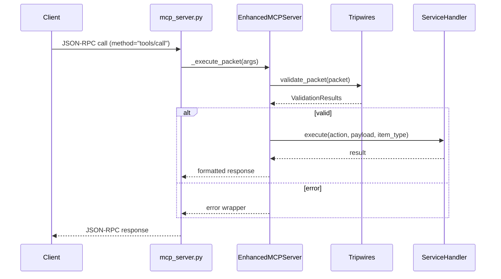

# Cairn Project – Architecture Overview

## 1. High-Level Purpose
The **Cairn** repository provides a programmable agent platform built around a **Model Context Protocol (MCP) Packet Server**.  External tools (e.g. Cursor, other LLM agents, CI jobs) communicate with the server exclusively via structured JSON-RPC packets passed through **stdin/stdout**.

Four external SaaS-style services are integrated today:

* **Todoist** – task & project management.
* **Google Calendar (gcal)** – calendar & event management.
* **Gmail** – email send / read / search.
* **DeepPCB** – PCB design automation (mock API with graceful fallback).

The goal is to expose a _uniform_ set of dynamic "tools" (functions) that let any agent call `execute_packet`, `list_services`, etc. without tying the agent to service-specific client libraries.

---

## 2. Directory Map (top level)
| Path | Purpose |
|------|---------|
| `mcp_packet_server/` | All MCP packet server implementation code |
| `pcb_designer/` | Source assets for DeepPCB demo boards |
| `API_explorer/` | Flask playground for free public APIs (not tightly coupled) |
| `cairn/` | Legacy HTTP demo server (orthogonal to MCP stack) |
| `todoist/`, `gmail/`, `google_calendar/` | Service-specific scratch spaces & example creds |
| `docs/` | (New) living documentation – diagrams, guides, design notes |

---

## 3. Core Execution Flow


---

## 4. Modular Service Architecture
```
mcp_packet_server/
└── services/
    ├── base_handler.py        # Shared ABC & utilities
    ├── todoist_handler.py     # Todoist integration
    ├── google_calendar_handler.py
    ├── gmail_handler.py
    └── deep_pcb_handler.py
```
Each handler declares:
* `supported_actions` – allowed CRUD verbs.
* `supported_item_types` – domain objects (e.g. `task`, `pcb_design`).
* `execute(action, payload, item_type)` – main dispatch.

Handlers may fall back to **mock mode** when real credentials are absent, avoiding crashes during offline development.

---

## 5. Validation Layer ("Tripwires")
`validation_tripwires.py` houses two guards:
1. **PacketValidationTripwires** – static schema & enum checks (tool_type, action, etc.).
2. **ServiceValidationTripwires** – dynamic checks using the registry of live service handlers (availability, action support, item-type support).

These ensure mis-formatted or unsupported packets never reach external services.

---

## 6. Dynamic Tool Registry (Planned)
Currently many tool names are hard-coded in `_register_all_tools()`.  The refactor roadmap will replace this with runtime discovery so adding a new handler automatically exposes its actions.

---

## 7. Environment & Secrets
Sensitive keys are stored in `mcp_packet_server/.env` (already git-ignored).  Handlers read via `os.getenv`, falling back to mock behaviour.

---

## 8. Developer On-Ramping Check-list
1. `pip install -r mcp_packet_server/requirements.txt`
2. Populate `.env` with service tokens (see `env.example`).
3. Run `python -m mcp_packet_server.mcp_server` and pipe JSON-RPC.
4. Execute tests: `pytest mcp_packet_server/tests` (to be added).

---

*This document is auto-generated during the July 2025 refactor to aid future agents.*

